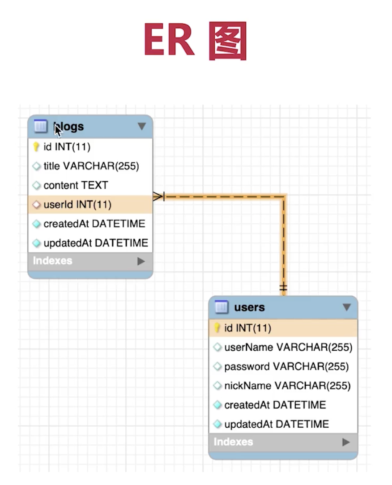

# koa2-weibo

使用 koa2 开发微博功能

## 技术栈

- 开发框架 koa2
- 前端模版 ejs
- 数据库 mysql
- 数据库 orm sequelize

## mysql

### 使用数据库

```
use koa2_weibo_db;
```

### 查询

```js
select * from blogs;

select username, nickname from users;

select username, nickname from users where username="zhangsan" and `password`='1234';

// 倒序
select * from blogs order by id desc;

// 限制查两个，跳过两个
select * from blogs order by id desc limit 2 offset 2;


// 查询数量
select count(id) from blogs;
```

### 新增

```js
insert into users(username, `password`, nickname) values ('zhangsan', '1234', '张三idusernameusers');
```

### 更新

```js
update blogs set content="内容1" where id=1
```

### 删除

```js
delete from blogs where id=3
```

### 外键



- 创建外键
- 更新限制&删除级联
- 连表查询

```js
// 连表查询 根据外键将表合并
select * from blogs inner join users on users.id = blogs.userid
// 挑选数据
select blogs.*, users.username, users.nickname from blogs inner join users on users.id = blogs.userid、
```
