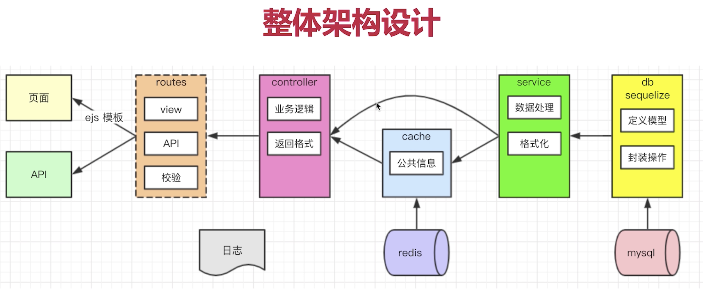

# koa2-weibo

使用 koa2 开发微博功能

## 技术栈

- 开发框架 koa2
- 前端模版 ejs
- 数据库 mysql
- 数据库 orm sequelize

## mysql

### 启动 mysql

打开系统偏好设置 --> 点开 mysql 小图标

### 使用数据库

```
use koa2_weibo_db;
```

### 查询

```js
select * from blogs;

select username, nickname from users;

select username, nickname from users where username="zhangsan" and `password`='1234';

// 倒序
select * from blogs order by id desc;

// 限制查两个，跳过两个
select * from blogs order by id desc limit 2 offset 2;


// 查询数量
select count(id) from blogs;
```

### 新增

```js
insert into users(username, `password`, nickname) values ('zhangsan', '1234', '张三idusernameusers');
```

### 更新

```js
update blogs set content="内容1" where id=1
```

### 删除

```js
delete from blogs where id=3
```

### 外键


- 创建外键
- 更新限制&删除级联
- 连表查询

```js
// 连表查询 根据外键将表合并
select * from blogs inner join users on users.id = blogs.userid
// 挑选数据
select blogs.*, users.username, users.nickname from blogs inner join users on users.id = blogs.userid
```

## sequelize

[中文文档](https://www.sequelize.cn/)

### ORM

- ORM-Object Relational Mapping 对象关系映射， 通过操作对象的方式操作数据库
- 数据表，用 JS 中的模型（class 或对象）代替
- 一条或多条记录，用 JS 中的一个对象或数组代替
- SQL 语句，用对象的方法来代替

## redis

内存数据库（mysql 是硬盘数据库）

### 启动 redis

redis-server

### 打开命令行操作

redis-cli

## cookie 和 session

**为什么 session 适合存储到 redis 中？**

- session 访问频繁，对性能要求高
- session 可以不考虑断电丢失的问题
- session 数据量不会太大（相比于 mysql 中存储的数据）

**为何网站数据不适合 redis**

- 操作频率没那么高(相比于 session 操作)
- 断电不能丢失，必须保留
- 数据量大，内存成本太高

## jwt

- 和 session 一样用于用户认证和用户存储的技术方案
- 用户认证成功后，server 端返回一个加密 token 给客户端
- 客户端后续每次请求都带 token，以示当前的用户身份

### jwt vs session

- 为了解决： 登录&存储用户信息
- jwt 用户信息加密存储在客户端， 不依赖 cookie，可跨域
- session 用户信息存储在服务端，依赖 cookie，默认不可跨域
- 大型系统中两种可以共用
- jwt 可能更适合用于服务节点比较多，跨域比较多的情况
- session 比较适合统一的 web 服务，server 要严格管理用户信息

## 调试

调试地址：chrome://inspect/#devices

## 技术方案设计

### 架构设计



### 页面（模版，路由）和 api 设计

**页面路由**

- 注册(/register)
- 登录(/login)
- 首页(/)
- 个人主页(/profile/:username)
- at 页 (/atme)
- 广场（/square）
- 设置（/setting）
- 错误页（/error）
- 404 (/\*)

**api 设计**

- 首页
  - 创建微博 /api/blog/create
- 图片上传 /api/utils/upload
  - 加载更多 /api/blog/loadMore/:pageIndex
  - 个人主页
- 加载更多 /api/profile/loadMore/:userName/:pageIndex
  - 关注 /api/profile/follow
  - 取消关注 /api/profile/unFollow
- 广场页
  - 加载更多 /api/square/loadMore/:pageIndex
- at 页
  - 创建微博 /api/blog/create
  - 图片上传 /api/utils/upload
  - 加载更多 /api/atMe/loadMore/:pageIndex

### 数据模型设计
